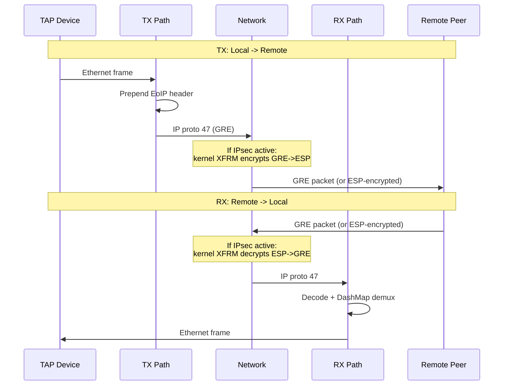

# EoIP-rs

MikroTik-compatible EoIP (Ethernet over IP) tunneling daemon for Linux and Windows, written in Rust.

Creates Layer 2 Ethernet tunnels over IP networks using the same wire format as MikroTik RouterOS, enabling direct interop with MikroTik routers and other EoIP-rs instances.

```
                    EoIP Tunnel (IP Protocol 47)
  +----------+  <------------------------------>  +----------+
  | EoIP-rs  |        Ethernet frames              | MikroTik |
  | (Linux)  |        encapsulated in GRE           | RouterOS |
  | eoip100  |                                      | eoip-tun |
  +----------+                                      +----------+
   10.255.0.2                                        10.255.0.1
```

## Features

- **MikroTik wire-compatible** -- byte-identical EoIP GRE headers, validated against RouterOS 7.18.2
- **MikroTik-style CLI** -- `eoip-cli` with RouterOS-inspired command syntax
- **Dynamic tunnel management** -- add/remove tunnels at runtime via gRPC API
- **High performance** -- lock-free DashMap demux, zero-copy buffer pool, adaptive batching
- **100-tunnel scaling** -- tested with 100 concurrent tunnels, 17 MB RSS
- **IPsec encryption** -- optional `ipsec-secret` for MikroTik-compatible ESP encryption via strongSwan
- **Cross-platform** -- Linux (full), Windows (preview), macOS (planned)
- **Protocol analyzer** -- decode and inspect EoIP pcap captures

## Quick Start

### From Binary Release

Download from [Releases](https://github.com/manawenuz/EoIP-rs/releases):

```bash
# Linux
tar xzf eoip-rs-*-linux-x86_64.tar.gz
cd eoip-rs-*-linux-x86_64
sudo ./install.sh
```

See [Installation Guide](docs/guides/INSTALL.md) for detailed instructions.

### From Source

```bash
git clone https://github.com/manawenuz/EoIP-rs.git
cd EoIP-rs
cargo build --release
```

Requirements: Rust 1.75+, protoc (Protocol Buffers compiler)

## Usage

### 1. Configure

```bash
sudo mkdir -p /etc/eoip-rs
sudo cp config/eoip-rs.example.toml /etc/eoip-rs/config.toml
sudo nano /etc/eoip-rs/config.toml
```

Minimal tunnel config:

```toml
[daemon]
helper_socket = "/run/eoip-rs/helper.sock"

[api]
listen = "[::1]:50051"

[[tunnel]]
tunnel_id = 100
local = "192.168.1.10"       # Your Linux IP
remote = "192.168.1.1"       # MikroTik IP
# ipsec_secret = "SecretPass"  # Optional: MikroTik-compatible IPsec encryption
```

### 2. Start

```bash
# Start helper (root, creates TAP devices)
sudo eoip-helper --mode persist &

# Start daemon
sudo eoip-rs --config /etc/eoip-rs/config.toml &

# Configure tunnel interface
sudo ip link set eoip100 up
sudo ip addr add 10.255.0.2/30 dev eoip100
```

Or use systemd:

```bash
sudo systemctl start eoip-helper
sudo systemctl start eoip-rs
```

### 3. Configure MikroTik

```routeros
/interface eoip add name=eoip-linux remote-address=192.168.1.10 tunnel-id=100
/ip address add address=10.255.0.1/30 interface=eoip-linux
```

### 4. Verify

```bash
ping 10.255.0.1                    # Ping through tunnel
eoip-cli print                     # List tunnels
eoip-cli print detail              # Detailed view
eoip-cli stats 100                 # Per-tunnel stats
```

## CLI Reference

EoIP-rs includes a MikroTik RouterOS-style CLI:

```
eoip-cli                                    # Interactive REPL
eoip-cli /interface/eoip/print              # One-shot command
eoip-cli --json /interface/eoip/stats       # JSON output
```

| Command | Description |
|---------|-------------|
| `print` | List all tunnels (table format) |
| `print detail` | Detailed tunnel properties |
| `print where tunnel-id=100` | Filter by tunnel ID |
| `add tunnel-id=200 remote-address=1.2.3.4 local-address=5.6.7.8` | Create tunnel |
| `remove 200` | Delete tunnel |
| `enable 200` / `disable 200` | Enable/disable tunnel |
| `set 200 mtu=1400` | Modify tunnel |
| `monitor` | Stream tunnel events |
| `stats` / `stats 100` | Global or per-tunnel statistics |
| `/system/health` | Daemon health check |

In REPL mode, the `/interface/eoip/` prefix is optional.

## Architecture

```mermaid
graph TB
    subgraph "eoip-helper (root)"
        TAP[TAP Creator]
        RAW[Raw Socket Creator]
    end

    subgraph "eoip-rs daemon"
        REG[Tunnel Registry<br/>DashMap]
        RX[RX Path<br/>raw socket -> decode -> TAP]
        TX[TX Path<br/>TAP -> encode -> raw socket]
        KA[Keepalive FSM]
        API[gRPC API<br/>tonic]
        MGR[Tunnel Manager]
        IPSEC[IPsec Manager<br/>VICI protocol]
    end

    subgraph "External"
        SW[strongSwan<br/>IKE daemon]
    end

    subgraph "eoip-cli"
        CLI[MikroTik-style CLI<br/>gRPC client]
    end

    TAP -->|SCM_RIGHTS<br/>fd passing| REG
    RAW -->|SCM_RIGHTS| RX
    RAW -->|SCM_RIGHTS| TX

    REG --> RX
    REG --> TX
    REG --> KA
    REG --> API

    CLI -->|gRPC| API
    API --> MGR
    MGR -->|CreateTunnel| TAP
    MGR -->|ipsec_secret| IPSEC
    IPSEC -->|VICI| SW
```



### Crate Structure

| Crate | Description |
|-------|-------------|
| `eoip-proto` | Wire format codec (GRE, EtherIP, UDP shim) |
| `eoip-helper` | Privileged helper (TAP + raw socket creation) |
| `eoip-rs` | Daemon core (packet processing, tunnel management) |
| `eoip-api` | gRPC service definitions (protobuf + tonic) |
| `eoip-cli` | Management CLI |
| `eoip-analyzer` | Pcap protocol analyzer |

### Packet Flow



## Performance

Tested on Hetzner CX23 (2 vCPU, 4 GB RAM):

| Metric | Result |
|--------|--------|
| TCP throughput (single tunnel) | 346 Mbps |
| Aggregate throughput (5 tunnels, 5 VMs) | 558 Mbps |
| Tunnel overhead (latency) | ~190 us |
| Memory (100 tunnels) | 17.6 MB RSS |
| Concurrent tunnels | 100 (all active, 0% loss) |
| MikroTik interop | Wire-format identical, 0% loss |
| IPsec throughput (AES-256-CBC) | ~230 Mbps encrypted |

Full results: [docs/performance/RESULTS.md](docs/performance/RESULTS.md)

## Documentation

- **[Installation Guide](docs/guides/INSTALL.md)** -- Binary install, compile from source, systemd setup
- **[MikroTik Setup Guide](docs/guides/MIKROTIK.md)** -- Configure MikroTik side for interop
- **[CLI Guide](docs/guides/CLI.md)** -- Full CLI command reference
- **[PMTUD & Auto-MTU](docs/guides/PMTUD.md)** -- Path MTU discovery, auto-detection, TCP MSS clamping
- **[IPsec Encryption](docs/guides/IPSEC.md)** -- Optional MikroTik-compatible IPsec via strongSwan
- **[Networking Guide](docs/guides/NETWORKING.md)** -- Bridging, DHCP, routing on Linux and Windows
- **[Protocol Specification](docs/design/protocol.md)** -- Wire format details
- **[Architecture](docs/design/architecture.md)** -- System design and crate structure
- **[Performance Results](docs/performance/RESULTS.md)** -- Benchmark data

## Windows (Preview)

Windows support uses tap-windows6 (OpenVPN TAP driver) and WinDivert for GRE packet injection. See [Windows Installation](docs/guides/INSTALL.md#windows).

## License

MIT
